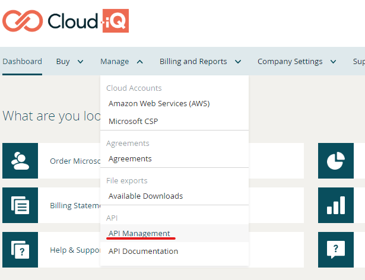
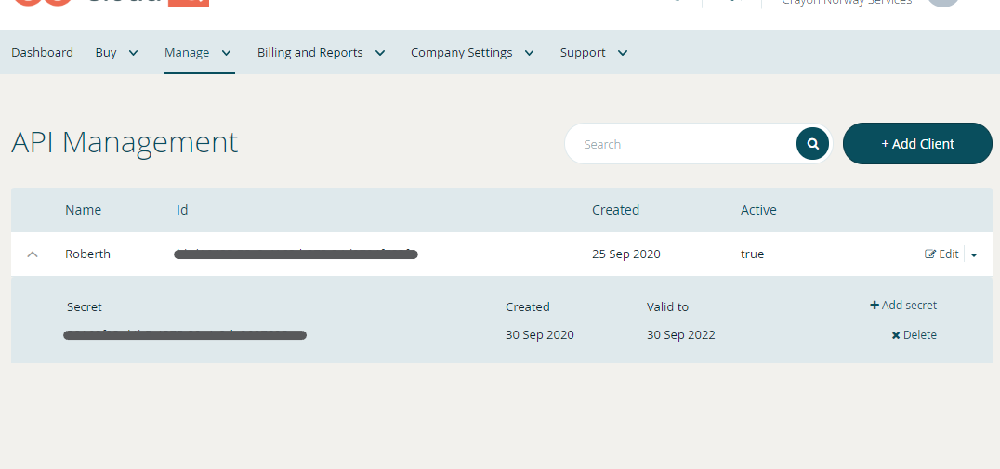

## Installation and upgrading the module

The module is published on the PowerShell Gallery, which is a public repository for modules, scripts and DSC resources created and maintained by the PowerShell team. This means that it's very easy to install the module on any system that is able to connect to the internet.

```powershell
# Install the module
Install-Module -Name CloudiQ

# Import the module into your session
Import-Module -Name CloudiQ
```

If you need to install a certain version, you can do so by specifying by using the ```-RequiredVersion``` parameter. If you need to use the module on a machine that has no access to the internet, you can download the [latest release](https://github.com/CrayonAS/Crayon.Cloud-iQ.PowerShell/releases) add it manually to your system. 

To keep the module updated, you can use:

```powershell
Update-Module -Name CloudiQ
```

## Authenticate and connect to Cloud-iQ

One you have the module installed and loaded, you can connect to Cloud-iQ by using the command ```Connect-CloudiQ``` with a client ID, client secret, as well as your username and password. To generate a client Id and secret, you need to go to the API management in Cloud-iQ and create a new client.





Then run the cmdlet to connect your PowerShell session to CloudiQ.

```powershell
Connect-CloudiQ -ClientId xxxxxxxx-xxxx-xxxx-xxxx-xxxxxxxxxxxx -ClientSecret xxxxxxxx-xxxx-xxxx-xxxx-xxxxxxxxxxxx
```

You will be asked for your username and password after running Connect-CloudiQ.

You can set username, password, client ID and client secret as environment variables. The names of the environment variables need to be the following:

* CloudiQClientId
* CloudiQClientSecret
* CloudiQUsername
* CloudiQPassword

If you run your script through a pipeline, see the documentation for your selected product on how to set environment variables. If you are running this on a machine where you have access to PowerShell, you can set the environment variables by running the following:

```powershell
# Username and password
New-Item -Path "Env:\" -Name 'CloudiQUsername' -Value 'username'
New-Item -Path "Env:\" -Name 'CloudiQPassword' -Value 'password'

# Client ID and secret
New-Item -Path "Env:\" -Name 'CloudiQClientId' -Value 'clientid'
New-Item -Path "Env:\" -Name 'CloudiQSecret' -Value 'clientsecret'
```

## Cmdlets

* [Connect-CloudiQ](functions/Connect-CloudiQ.md)

### Organization

* [Get-CloudiQOrganization](functions/Get-CloudiQOrganization.md)

### Subscription

* [Get-CloudiQSubscription](functions/Get-CloudiQSubscription.md)
* [Set-CloudiQSubscription](functions/Set-CloudiQSubscription.md)